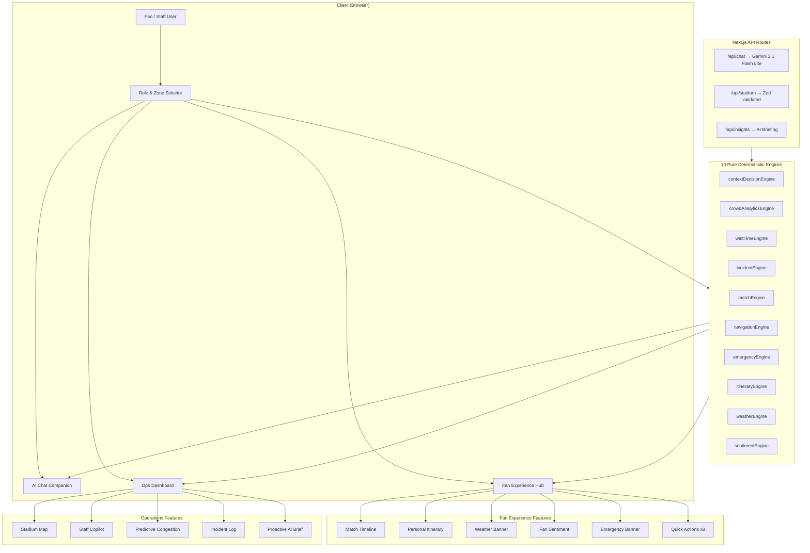

# ⚽ PitchPilot
### AI-Powered Smart Stadium Operations Platform for FIFA World Cup 2026

<p align="center">


</p>

<p align="center">

 <a href="https://vercel.com/ketchupirl-6129s-projects/fifamain">Live Demo</a> •
 <a href="./docs/ARCHITECTURE.md">Architecture</a> •
 <a href="./docs/ALIGNMENT.md">Documentation</a>

</p>

---

##  Overview

PitchPilot is an AI-powered Smart Stadium Operations Platform built for the **FIFA World Cup 2026**.

It combines **deterministic AI systems** with **Google Gemini 3.1 Flash Lite** to assist fans, stadium operators, organizers, and security teams in making intelligent, real-time decisions.

The platform predicts congestion, optimizes crowd movement, recommends evacuation routes, provides multilingual assistance, and improves the overall stadium experience across **16 World Cup host stadiums**.

---

# ✨ Key Highlights

- 🤖 Google Gemini powered AI assistant
- 🧠 10 deterministic AI engines
- 📈 Predictive congestion forecasting
- 🗺 Dijkstra shortest-path navigation
- 🚨 Emergency evacuation planning
- 🌎 Multilingual support
- ♿ Accessibility-first design
- 🧪 163+ automated tests
- 🔒 Strict TypeScript + Zod validation

---

# 📊 Project Metrics

| Metric | Value |
|---------|------:|
| AI Engines | 10 |
| Unit Tests | 163+ |
| Stadium Zones | 9 |
| Supported Stadiums | 16 |
| Languages | 4 |
| TypeScript | Strict |
| Validation | Zod |
| Deployment | Vercel |

---

# 🎯 How This Solves the Problem Statement

> **Challenge Statement**
>
> *"Create a GenAI-powered solution to optimize stadium operations and enhance the FIFA World Cup 2026 experience through intelligent, real-time assistance."*

---

## 🤖 GenAI-Powered Solution

PitchPilot leverages **Google Gemini 3.1 Flash Lite** together with deterministic AI engines to provide intelligent, context-aware assistance for fans, stadium staff, security personnel, and tournament organizers.

| Feature | Implementation |
|---------|----------------|
| 🤖 AI Chat | `app/api/chat/route.ts` — Google Gemini 3.1 Flash Lite with match, navigation, weather, and emergency context |
| 🧠 Proactive AI Briefings | `components/dashboard/ProactiveInsightBrief.tsx` — Identifies operational bottlenecks via `app/api/insights/route.ts` |
| 👨‍💼 AI Staff Copilot | `components/dashboard/StaffCopilot.tsx` — Decision support with actionable operational recommendations |

---

# 🏟 Optimizing Stadium Operations

PitchPilot provides AI-assisted operational intelligence for tournament organizers and stadium management.

| Capability | Description |
|------------|-------------|
| 🌍 Multi-Stadium Support | Supports all **16 FIFA World Cup 2026 Host Stadiums** including Azteca, SoFi, MetLife, AT&T Stadium, and more |
| 👑 Organizer Dashboard | Dedicated operational overview for tournament organizers |
| 📊 9-Zone Crowd Analytics | Density heatmaps, bottleneck detection, and occupancy monitoring (`lib/engine/crowdAnalyticsEngine.ts`) |
| 📈 Predictive Congestion | Forecasts zone occupancy **15 minutes ahead** (`components/dashboard/PredictiveCongestion.tsx`) |
| 🚨 Incident Management | Prioritizes incidents, dispatches nearest staff, and calculates response times (`lib/engine/incidentEngine.ts`) |
| 🗺 Interactive Stadium Map | Live SVG-based visualization of all stadium zones (`components/dashboard/GraphicalStadiumMap.tsx`) |

---

# ⚽ Enhancing the FIFA World Cup Fan Experience

PitchPilot personalizes every fan's match-day journey through intelligent recommendations.

| Feature | Description |
|---------|-------------|
| 🌐 Multilingual Support | English, Spanish, French, and Arabic |
| 🚨 SOS Emergency Broadcast | One-tap emergency routing from the Fan Hub |
| 🌱 Green Travel Badge | Rewards sustainable transportation choices |
| 🏆 Live Match Timeline | Goals, cards, substitutions, and VAR events in real time |
| 📅 Personal Itinerary | Time-aware suggestions such as *"Kickoff in 25 minutes — grab food now."* |
| ❤️ Fan Sentiment Meter | Live crowd excitement visualization |
| 🌦 Weather Intelligence | Weather alerts with smart gate recommendations |
| ⚡ 8 Quick Actions | Food, Restrooms, Navigation, Merchandise, Accessibility, Match Stats, Weather, Report Issue |

---

# ⚡ Intelligent Real-Time Assistance

The platform continuously adapts to live stadium conditions.

| Capability | Description |
|------------|-------------|
| 🧭 Dijkstra Navigation | Shortest-path routing with distance, ETA, and landmarks (`lib/engine/navigationEngine.ts`) |
| 🚪 Emergency Evacuation | Intelligent evacuation routes that avoid unsafe zones (`lib/engine/emergencyEngine.ts`) |
| 💬 Context-Aware AI Chat | Responses adapt based on user role, stadium, weather, zone, and match phase |
| 🔄 Deterministic Offline Fallback | Full functionality without an API key using deterministic engines |

---

# 🧠 Smart & Dynamic AI Assistant

PitchPilot combines LLM capabilities with deterministic reasoning for explainable AI.

| Component | Purpose |
|-----------|---------|
| 🧩 Context Decision Engine | Maps `UserProfile + StadiumState → ContextRecommendation[]` |
| ⚙️ 10 Pure AI Engines | Independent, reusable, framework-agnostic business logic |
| 🎭 Role-Adaptive UI | Dedicated interfaces for Fans, Staff, Security, and Organizers |

---

# 🏗 Clean, Maintainable & Production-Ready Architecture

PitchPilot is designed following modern software engineering best practices.

| Engineering Practice | Benefit |
|----------------------|---------|
| 🧪 163+ Unit Tests | Comprehensive testing across every engine, component, and edge case |
| 🔷 Strict TypeScript | Zero `any` and zero `eslint-disable` |
| ✅ Zod Validation | End-to-end validation for API inputs, LLM outputs, and responses |
| 📦 Modular Codebase | Files under **200 lines** with focused responsibilities |
| ⚙️ Pure Functional Architecture | Deterministic engines with zero side effects and zero React coupling |

---

## 💡 Why This Matters

PitchPilot demonstrates how **Generative AI** and **deterministic decision engines** can work together to deliver:

- 🤖 Explainable AI recommendations
- ⚡ Real-time operational intelligence
- 🏟 Smarter stadium management
- 👥 Personalized fan experiences
- 🚨 Faster emergency response
- 📈 Scalable, production-ready architecture
- 🔒 Reliable offline fallback without LLM dependency


# 🏗 System Architecture



---

# 🚀 Features

## 👥 Fan Experience

- Live Match Timeline
- Smart Navigation
- Wait Time Estimation
- Weather Advisories
- Emergency Alerts
- Personal Match Itinerary
- Crowd Sentiment
- Accessibility Assistance

---

## 🛡 Stadium Operations

- AI Staff Copilot
- Incident Management
- Crowd Density Heatmaps
- Predictive Congestion
- Zone Analytics
- Proactive AI Briefings
- Organizer Dashboard

---

## 🤖 AI Features

- Google Gemini Chat
- Context-aware Responses
- Deterministic Offline Fallback
- Role-aware Prompts
- Match-aware Conversations

---

# 🧠 Engineering Highlights

- Pure Functional Architecture
- 10 Independent AI Engines
- Server Components
- App Router
- Zod Validation
- Zero `any`
- Modular Design
- Accessibility (ARIA)
- 163+ Unit Tests

---

# 🛠 Tech Stack

| Category | Technologies |
|-----------|--------------|
| Frontend | Next.js 16, React, TypeScript |
| Styling | Tailwind CSS |
| AI | Google Gemini 3.1 Flash Lite |
| Validation | Zod |
| Testing | Vitest, React Testing Library |
| Deployment | Vercel |

---

# 📂 Project Structure

```text
smart-stadium/
├── app/
│   ├── api/
│   │   ├── chat/route.ts              # Gemini chat endpoint (server-only)
│   │   ├── insights/route.ts          # AI proactive briefing endpoint
│   │   └── stadium/route.ts           # Stadium data endpoint
│   ├── globals.css                    # Tailwind v4 + custom styles
│   ├── layout.tsx                     # Root layout with SEO metadata
│   └── page.tsx                       # Main app orchestrator
├── components/
│   ├── chat/                          # Chat UI (Panel, Message, Input)
│   ├── dashboard/                     # Ops Dashboard
│   │   ├── StadiumOverview.tsx        # Key metrics overview
│   │   ├── GraphicalStadiumMap.tsx    # Interactive SVG zone map
│   │   ├── CrowdDensityCard.tsx       # Zone density visualization
│   │   ├── WaitTimeCard.tsx           # Venue wait times
│   │   ├── IncidentLog.tsx            # Priority-sorted incidents
│   │   ├── ZoneStatusGrid.tsx         # Zone status cards
│   │   ├── ProactiveInsightBrief.tsx  # AI-generated operational insights
│   │   ├── StaffCopilot.tsx           # AI staff task management
│   │   └── PredictiveCongestion.tsx   # 15-min congestion forecast
│   ├── fan/                           # Fan Experience Hub
│   │   ├── MatchTimeline.tsx          # Live match events
│   │   ├── PersonalItinerary.tsx      # Match-day planning
│   │   ├── WeatherBanner.tsx          # Weather advisories
│   │   ├── FanSentiment.tsx           # Crowd sentiment meter
│   │   ├── EmergencyBanner.tsx        # Evacuation alerts
│   │   ├── QuickActions.tsx           # 8 quick action buttons
│   │   ├── WaitTimeDisplay.tsx        # Venue wait times
│   │   └── RecommendationCard.tsx     # Context-aware tips
│   ├── layout/                        # Header, Sidebar
│   └── ui/                            # Shared (Card, Badge, ProgressBar, Spinner)
├── lib/
│   ├── engine/                        # 10 pure deterministic engines
│   │   ├── contextDecisionEngine.ts   # Role/zone/phase → recommendations
│   │   ├── crowdAnalyticsEngine.ts    # Zone density & bottleneck detection
│   │   ├── waitTimeEngine.ts          # Queue wait time estimation
│   │   ├── incidentEngine.ts          # Incident priority & staff dispatch
│   │   ├── matchEngine.ts            # Match event recommendations
│   │   ├── navigationEngine.ts       # Dijkstra zone routing
│   │   ├── emergencyEngine.ts        # Evacuation route planning
│   │   ├── itineraryEngine.ts        # Personal itinerary generation
│   │   ├── weatherEngine.ts          # Weather-based advisories
│   │   └── sentimentEngine.ts        # Crowd sentiment scoring
│   ├── data/                          # Deterministic mock data generators
│   │   ├── mockStadiumData.ts         # Zone occupancy, venues, match state
│   │   └── mockIncidents.ts           # Simulated incidents
│   ├── hooks/                         # Custom React hooks
│   │   └── useStadiumState.ts         # State management & polling
│   ├── utils/constants.ts             # All magic numbers & config
│   ├── types.ts                       # Strict TypeScript interfaces (270 lines)
│   └── schemas.ts                     # Zod validation schemas
├── __tests__/                         # 146 unit & integration tests
│   ├── engine/                        # Engine logic tests (10 files)
│   └── components/                    # Component render tests (4 files)
├── vitest.config.ts
└── .env.local                         # Server-side secrets (gitignored)
```

---

# ⚙ Getting Started

## Clone Repository

```bash
git clone https://github.com/ketchuphere/fifamain.git
cd fifamain
```

Install dependencies

```bash
npm install
```

Create environment file

```bash
cp .env.local.example .env.local
```

Add

```env
GOOGLE_GENERATIVE_AI_API_KEY=YOUR_KEY
```

Start development server

```bash
npm run dev
```

Production build

```bash
npm run build
npm start
```

Deploy

```bash
npx vercel --prod
```

---

# 🧪 Testing

Run all tests

```bash
npm run test
```

Watch mode

```bash
npm run test:watch
```

Type checking

```bash
npx tsc --noEmit
```

Lint

```bash
npm run lint
```

---

# 🎯 Why This Project Stands Out

✅ AI + Deterministic Decision Systems

✅ Production-grade Next.js Architecture

✅ Context-aware Intelligent Assistant

✅ Scalable Component Design

✅ Test-driven Development

✅ Accessibility-first

✅ Real-world Stadium Operations Use Case

---

# 📌 Future Roadmap

- Voice Assistant
- AR Navigation
- Real IoT Sensors
- Edge AI
- Digital Twin Stadium
- Parking Integration
- Historical Analytics
- Multi-agent Coordination

---

# 👨‍💻 Author

**Keshav Chawda**

Software & AI Engineering • Machine Learning • Data Science

---

<p align="center">

⭐ If you found this project interesting, consider starring the repository!

</p>
