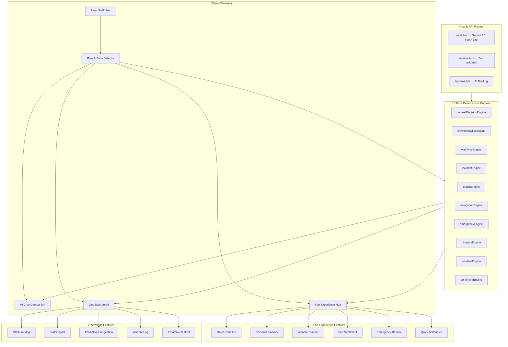

# ⚽ PitchPilot
### AI-Powered Smart Stadium Operations Platform for FIFA World Cup 2026

<p align="center">


</p>

<p align="center">

 <a href="https://vercel.com/ketchupirl-6129s-projects/fifamain">Live Demo</a> •
 <a href="./docs/ARCHITECTURE.md">Architecture</a> •
 <a href="./docs/ALIGNMENT.md">Documentation</a>

</p>

---

##  Overview

PitchPilot is an AI-powered Smart Stadium Operations Platform built for the **FIFA World Cup 2026**.

It combines **deterministic AI systems** with **Google Gemini 3.1 Flash Lite** to assist fans, stadium operators, organizers, and security teams in making intelligent, real-time decisions.

The platform predicts congestion, optimizes crowd movement, recommends evacuation routes, provides multilingual assistance, and improves the overall stadium experience across **16 World Cup host stadiums**.

---

# ✨ Key Highlights

- 🤖 Google Gemini powered AI assistant
- 🧠 10 deterministic AI engines
- 📈 Predictive congestion forecasting
- 🗺 Dijkstra shortest-path navigation
- 🚨 Emergency evacuation planning
- 🌎 Multilingual support
- ♿ Accessibility-first design
- 🧪 163+ automated tests
- 🔒 Strict TypeScript + Zod validation

---

# 📊 Project Metrics

| Metric | Value |
|---------|------:|
| AI Engines | 10 |
| Unit Tests | 163+ |
| Stadium Zones | 9 |
| Supported Stadiums | 16 |
| Languages | 4 |
| TypeScript | Strict |
| Validation | Zod |
| Deployment | Vercel |

---

# 🖼 Preview

Approach and Logic

Deterministic Engine Architecture

PitchPilot's core intelligence lives in 10 pure, deterministic engines inside lib/engine/, completely decoupled from the UI:

Engine

File

Responsibility

Context Decision

contextDecisionEngine.ts

Maps UserProfile + StadiumState → prioritized ContextRecommendation[] based on role, zone, match phase, and accessibility

Crowd Analytics

crowdAnalyticsEngine.ts

Calculates zone density levels, identifies bottlenecks, computes total occupancy

Wait Time

waitTimeEngine.ts

Estimates queue wait times using service-rate modeling, finds shortest queues

Incident

incidentEngine.ts

Prioritizes incidents by severity/recency, assigns nearest available staff

Match

matchEngine.ts

Generates match-context recommendations for goals, cards, half-time

Navigation

navigationEngine.ts

Dijkstra's shortest-path routing between 9 stadium zones

Emergency

emergencyEngine.ts

Evacuation routing with zone compromise detection and exit selection

Itinerary

itineraryEngine.ts

Phase-aware personal match-day planning

Weather

weatherEngine.ts

Temperature/condition-based advisories with gate recommendations

Sentiment

sentimentEngine.ts

Crowd sentiment scoring from match events, phase, and incidents

Why this matters:

All business logic is unit-testable with 146+ passing tests

Zero coupling to React — engines can be reused server-side, in workers, or in a mobile app

Every recommendation is explainable and reproducible given the same inputs

Zod Validation Pipeline

Every data boundary is validated:

User Input → chatRequestSchema (Zod) → Server Route
LLM Response → llmResponseSchema (Zod) → Client Rendering
Stadium Data → stadiumApiResponseSchema (Zod) → API Response

This prevents malformed LLM outputs, injection attacks, and type inconsistencies from ever reaching the UI.

Feature Showcase

Fan Experience Hub

Feature

Component

Engine

8 Quick Actions

QuickActions.tsx

—

Live Match Timeline

MatchTimeline.tsx

matchEngine.ts

Personal Itinerary

PersonalItinerary.tsx

itineraryEngine.ts

Weather Advisory

WeatherBanner.tsx

weatherEngine.ts

Crowd Sentiment

FanSentiment.tsx

sentimentEngine.ts

Emergency Banner

EmergencyBanner.tsx

emergencyEngine.ts

Wait Time Display

WaitTimeDisplay.tsx

waitTimeEngine.ts

Smart Recommendations

RecommendationCard.tsx

contextDecisionEngine.ts

Operations Dashboard

Feature

Component

Engine

Interactive Stadium Map

GraphicalStadiumMap.tsx

crowdAnalyticsEngine.ts

AI Staff Copilot

StaffCopilot.tsx

incidentEngine.ts

Predictive Congestion

PredictiveCongestion.tsx

crowdAnalyticsEngine.ts

Proactive AI Briefing

ProactiveInsightBrief.tsx

Gemini 3.1 Flash Lite

Zone Status Grid

ZoneStatusGrid.tsx

crowdAnalyticsEngine.ts

Crowd Density Card

CrowdDensityCard.tsx

crowdAnalyticsEngine.ts

Wait Time Card

WaitTimeCard.tsx

waitTimeEngine.ts

Incident Log

IncidentLog.tsx

incidentEngine.ts

AI Chat Companion

Role-adaptive system prompt (fan vs. staff vs. security)

Full context injection: match score, weather, zone, incidents

Structured output parsing with Zod validation

Graceful fallback to deterministic engine responses

---

# 🏗 System Architecture



---

# 🚀 Features

## 👥 Fan Experience

- Live Match Timeline
- Smart Navigation
- Wait Time Estimation
- Weather Advisories
- Emergency Alerts
- Personal Match Itinerary
- Crowd Sentiment
- Accessibility Assistance

---

## 🛡 Stadium Operations

- AI Staff Copilot
- Incident Management
- Crowd Density Heatmaps
- Predictive Congestion
- Zone Analytics
- Proactive AI Briefings
- Organizer Dashboard

---

## 🤖 AI Features

- Google Gemini Chat
- Context-aware Responses
- Deterministic Offline Fallback
- Role-aware Prompts
- Match-aware Conversations

---

# 🧠 Engineering Highlights

- Pure Functional Architecture
- 10 Independent AI Engines
- Server Components
- App Router
- Zod Validation
- Zero `any`
- Modular Design
- Accessibility (ARIA)
- 163+ Unit Tests

---

# 🛠 Tech Stack

| Category | Technologies |
|-----------|--------------|
| Frontend | Next.js 16, React, TypeScript |
| Styling | Tailwind CSS |
| AI | Google Gemini 3.1 Flash Lite |
| Validation | Zod |
| Testing | Vitest, React Testing Library |
| Deployment | Vercel |

---

# 📂 Project Structure

```text
smart-stadium/
├── app/
│   ├── api/
│   │   ├── chat/route.ts              # Gemini chat endpoint (server-only)
│   │   ├── insights/route.ts          # AI proactive briefing endpoint
│   │   └── stadium/route.ts           # Stadium data endpoint
│   ├── globals.css                    # Tailwind v4 + custom styles
│   ├── layout.tsx                     # Root layout with SEO metadata
│   └── page.tsx                       # Main app orchestrator
├── components/
│   ├── chat/                          # Chat UI (Panel, Message, Input)
│   ├── dashboard/                     # Ops Dashboard
│   │   ├── StadiumOverview.tsx        # Key metrics overview
│   │   ├── GraphicalStadiumMap.tsx    # Interactive SVG zone map
│   │   ├── CrowdDensityCard.tsx       # Zone density visualization
│   │   ├── WaitTimeCard.tsx           # Venue wait times
│   │   ├── IncidentLog.tsx            # Priority-sorted incidents
│   │   ├── ZoneStatusGrid.tsx         # Zone status cards
│   │   ├── ProactiveInsightBrief.tsx  # AI-generated operational insights
│   │   ├── StaffCopilot.tsx           # AI staff task management
│   │   └── PredictiveCongestion.tsx   # 15-min congestion forecast
│   ├── fan/                           # Fan Experience Hub
│   │   ├── MatchTimeline.tsx          # Live match events
│   │   ├── PersonalItinerary.tsx      # Match-day planning
│   │   ├── WeatherBanner.tsx          # Weather advisories
│   │   ├── FanSentiment.tsx           # Crowd sentiment meter
│   │   ├── EmergencyBanner.tsx        # Evacuation alerts
│   │   ├── QuickActions.tsx           # 8 quick action buttons
│   │   ├── WaitTimeDisplay.tsx        # Venue wait times
│   │   └── RecommendationCard.tsx     # Context-aware tips
│   ├── layout/                        # Header, Sidebar
│   └── ui/                            # Shared (Card, Badge, ProgressBar, Spinner)
├── lib/
│   ├── engine/                        # 10 pure deterministic engines
│   │   ├── contextDecisionEngine.ts   # Role/zone/phase → recommendations
│   │   ├── crowdAnalyticsEngine.ts    # Zone density & bottleneck detection
│   │   ├── waitTimeEngine.ts          # Queue wait time estimation
│   │   ├── incidentEngine.ts          # Incident priority & staff dispatch
│   │   ├── matchEngine.ts            # Match event recommendations
│   │   ├── navigationEngine.ts       # Dijkstra zone routing
│   │   ├── emergencyEngine.ts        # Evacuation route planning
│   │   ├── itineraryEngine.ts        # Personal itinerary generation
│   │   ├── weatherEngine.ts          # Weather-based advisories
│   │   └── sentimentEngine.ts        # Crowd sentiment scoring
│   ├── data/                          # Deterministic mock data generators
│   │   ├── mockStadiumData.ts         # Zone occupancy, venues, match state
│   │   └── mockIncidents.ts           # Simulated incidents
│   ├── hooks/                         # Custom React hooks
│   │   └── useStadiumState.ts         # State management & polling
│   ├── utils/constants.ts             # All magic numbers & config
│   ├── types.ts                       # Strict TypeScript interfaces (270 lines)
│   └── schemas.ts                     # Zod validation schemas
├── __tests__/                         # 146 unit & integration tests
│   ├── engine/                        # Engine logic tests (10 files)
│   └── components/                    # Component render tests (4 files)
├── vitest.config.ts
└── .env.local                         # Server-side secrets (gitignored)
```

---

# ⚙ Getting Started

## Clone Repository

```bash
git clone https://github.com/ketchuphere/fifamain.git
cd fifamain
```

Install dependencies

```bash
npm install
```

Create environment file

```bash
cp .env.local.example .env.local
```

Add

```env
GOOGLE_GENERATIVE_AI_API_KEY=YOUR_KEY
```

Start development server

```bash
npm run dev
```

Production build

```bash
npm run build
npm start
```

Deploy

```bash
npx vercel --prod
```

---

# 🧪 Testing

Run all tests

```bash
npm run test
```

Watch mode

```bash
npm run test:watch
```

Type checking

```bash
npx tsc --noEmit
```

Lint

```bash
npm run lint
```

---

# 🎯 Why This Project Stands Out

✅ AI + Deterministic Decision Systems

✅ Production-grade Next.js Architecture

✅ Context-aware Intelligent Assistant

✅ Scalable Component Design

✅ Test-driven Development

✅ Accessibility-first

✅ Real-world Stadium Operations Use Case

---

# 📌 Future Roadmap

- Voice Assistant
- AR Navigation
- Real IoT Sensors
- Edge AI
- Digital Twin Stadium
- Parking Integration
- Historical Analytics
- Multi-agent Coordination

---

# 👨‍💻 Author

**Keshav Chawda**

Software & AI Engineering • Machine Learning • Data Science

---

<p align="center">

⭐ If you found this project interesting, consider starring the repository!

</p>
